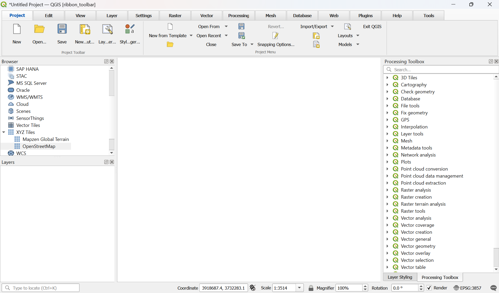

# Ribbon Toolbar

A QGIS plugin that replaces the default menus and toolbars with a Microsoft Office-like ribbon interface.

**Disclaimer**: this plugin is entirely generated by AI as a proof of concept. Use with caution.

## Features

- Tabbed ribbon interface organized by QGIS function category
- Groups derived directly from QGIS native menus and toolbars — no hardcoded action lists
- Large-icon primary groups for frequently used toolbars (File, Navigation, Digitize, etc.)
- Small-icon grid layout for secondary groups
- Dedicated "Tools" tab for Snapping, Labels, Selection and Annotation toolbars
- Third-party plugin toolbars collected automatically under the Plugins tab
- One-click toggle to switch back to the classic QGIS interface

## Usage

After installation a **Toggle Ribbon Toolbar** button appears in the QGIS toolbar. Click it to activate the ribbon. Click again to restore the classic interface.

## Author

Eithan Weiss Schonberg — <eithan.schonberg@gmail.com>

